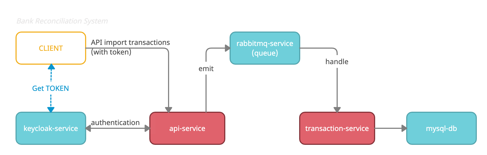

# TÀI LIỆU THIẾT KẾ

## Sơ đồ hệ thống


---

## Mô tả các thành phần

|  stt | docker container |  thư mục | Mô tả |
| ---- | ---------------- | -------- | ------|
| 1  |  mysql-db  |  | Lưu trử các transactions sau khi được import  |
| 2  |  keycloak-service | |  Xử lý-chứng thực người dùng, cụ thể là chứng thực **OAuth2** cho `api-service` |
| 3  |  rabbitmq-service | | Quản lý hàng đợi `queue` cho các yêu cầu import transaction|
| 4  |  api-service | api-service |- Triển khai api cho người dùng import transaction <br/>- API được chứng thực OAuth2 từ `keycloak-service` <br/>- Kiểm tra tính hợp lệ của dữ liệu. <br/>- Gửi yêu cầu insert lên hàng đợi `rabbitmq-service` |
| 5  |  transaction-service | api-transaction |- Tiếp nhận yêu cầu từ hàng đợi `rabbitmq-service` <br/>- Xử lý lưu thông tin vào database.<br/>- Xử lý rollback dữ liệu và ghi log nếu có lỗi xảy ra |

---

## Hướng dẫn khởi chạy

### jest test:
- Trên giao diện terminal, di chuyển đến thư mục `api-service`, chạy lần lượt lệnh:
```bash
npm install
npm run test
```

- Trên giao diện terminal, di chuyển đến thư mục `transaction-service`, chạy lần lượt lệnh:
```bash
npm install
npm run test
```

### run all services:

- Đảm bảo các ports sau trong trạng thái không được sử dụng: `3306`, `8080`, `15672`, `5672`, `3001`
- Trên giao diện terminal, di chuyển đến thư mục chính của project, chạy lệnh:
```docker
docker-compose up -d --build
```
- Sau khi các docker container run DONE, tuy nhiên cần đợi thêm khoản 1 phút để các services được load đầy đủ.

### Thông tin truy cập:
|  stt | service              | thông tin |
| ---- | -------------------- |-----------|
| 1    |  mysql-db            |- Host: localhost <br/>- Port: 3306 <br/> - Username: root <br/>- Password: 123456|
| 2    |  keycloak-service    |- Url: http://localhost:8080/auth/admin <br/> - Username: admin <br/>- Password: admin|
| 3    |  rabbitmq-service    |- Url: http://localhost:15672/ <br/> - Username: guest <br/>- Password: guest|
| 4    |  api-service         |- Host: localhost <br/> - Port: 3001 <br/> - Swagger url: http://localhost:3001/api/|
| 5    |  transaction-service |_.._|

---


## Hướng dẫn sử dụng (sau khi đã chạy hệ thống)

### Tạo mới USER

### Lấy token
Trên giao diện terminal, chạy lệnh :
```bash
curl --location --request POST 'http://localhost:8080/auth/realms/abc_bank/protocol/openid-connect/token' \
--header 'Content-Type: application/x-www-form-urlencoded' \
--data-urlencode 'username={{username}}' \
--data-urlencode 'password={{password}}' \
--data-urlencode 'grant_type=password' \
--data-urlencode 'client_secret=48464a7a-f5f3-4893-98c2-a05ccd99c3d9' \
--data-urlencode 'client_id=api-transaction-service'
```
Params gồm có: <br/>
- `{{username}}`: là username đã tạo mới ở bước trên
- `{{pasword}}`: là password của user đã tạo ở bước trên

Response gồm có: 
- `access_token`: là token dùng để gọi api import transaction

### Gọi API import transaction 
Trên giao diện terminal, chạy lệnh :
```bash
curl --location --request POST 'http://localhost:3001/banking/import-bank-transaction' \
--header 'Authorization: Bearer {{access_token}}' \
--form 'file=@"{{file_path}}"'
```
Params gồm có: <br/>
- `{{access_token}}`: là access_token từ response ở bước lấy token
- `{{file_path}}`: là đường dẫn tuyệt đối của file CSV cần import. Các file mẫu có sẳn trong thư mục `data-sheet-sample`

Response gồm có: 
- `countTransactionImporting`: tổng số lượng transaction đang được insert
- `listInvalidFormat`: là danh sách các dòng dữ liệu lỗi định dạng. Trong đó: `index`-thứ tự của dòng đó (bắt đầu từ 0), `row`-chi tiết dòng dữ liệu đó
- Ví dụ:
```json
{
    "countTransactionImporting": 27,
    "listInvalidFormat": [
        {
            "index": 2,
            "row": "21/03/2020 10:20:12,Any text there,100.001,Deposit-wrong"
        }
    ]
}
```
## -- End --
